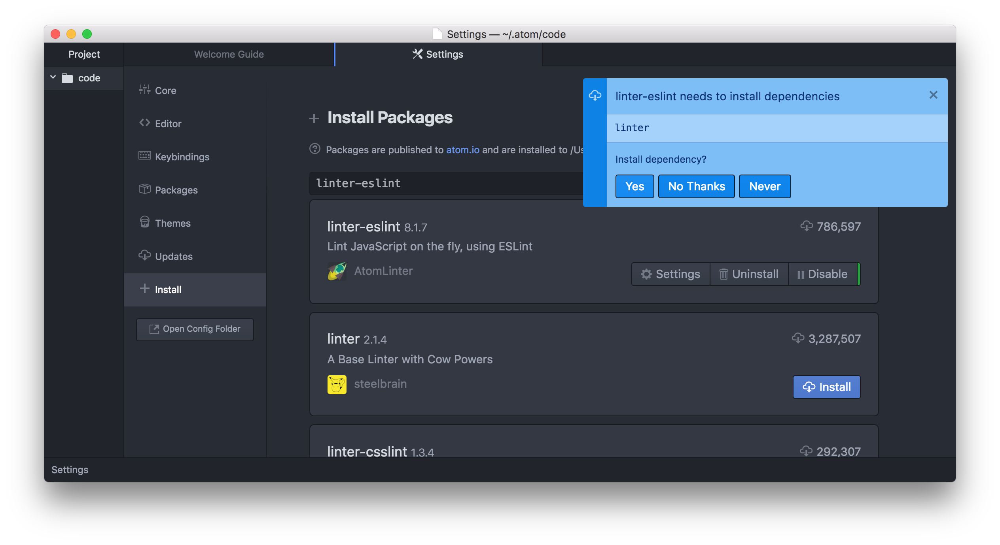

# Exercise 1: Install Atom

Atom is an open source, customizable text editor. People from all around the world write `plugins/packages` to add more functionality to the editor (i.e. a linter to make sure you are using correct syntax when writing code). These addons make it the perfect tool for programmers. This guide will help you download Atom and set it up for use in this course.

## Instructions

1. Go to [https://atom.io/](https://atom.io/) and press the **Download For Mac/Download Windows Installer** button.

1. Once downloaded:

    - **(Mac)** move the Atom App to your Applications directory
    - **(Windows)** run the .exe installer and install Atom

1. Run Atom!

1. **(Mac Only)** Open the `Atom` menu and click on `Install Shell Commands`.

    

1. Open up the `Preferences` or `Settings` menu

    - **Mac** Under `Atom` > `Preferences`
    - **Windows** Under `File` > `Settings`

1. Go to the `+ Install` tab

    

1. Search for `linter-eslint` where it says **Search packages** and
  then click `Install`

    

1. Press `Yes` to install dependencies, if requested.

    

1. Congratulations! You have performed the minimal Atom setup required for this course.

   Now, let's move on to [Exercise 2: Install Git](./gitInstall.md)!

### What's a linter?

A linter is a program that checks source code for stylistic and programmatic
errors. This helps keep your code clean, and minimizes mistakes made during
coding. They exist for all programming languages, not just Javascript. The code
block below is an example of possible linting errors.

```javascript
var foo = 1
, // Error: comma has to be at the end of the previous line
bar = 2;

if (true) {
  foo = 10;
    return; // Error: code must be indented by 2 spaces
}
```

An example would look like this:


