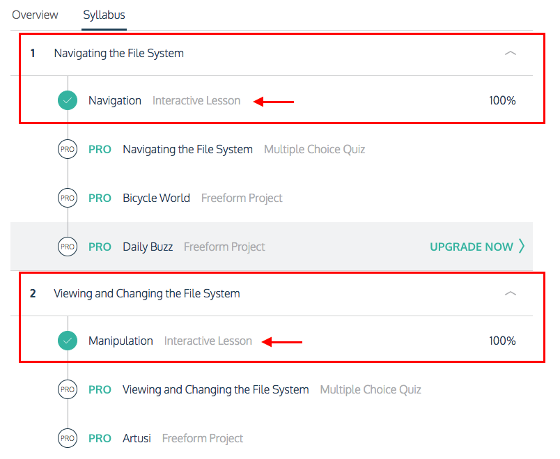

# Exercise 3: Learn the command line

1. Go to the [Code Academy course on the Command Line](https://www.codecademy.com/learn/learn-the-command-line)
1. Complete the interactive course *Navigating the File System > Navigation*
1. Complete the interactive course *Viewing and Changing the File System > Manipulation*
1. Move on to the next exercise when you are done. [Exercise 4: Learn Git](./gitLearn.md)

⚠️⚠️⚠️ **Only complete these two interactive courses. Skip the quizzes and
and freeform projects.** ⚠️⚠️⚠️

