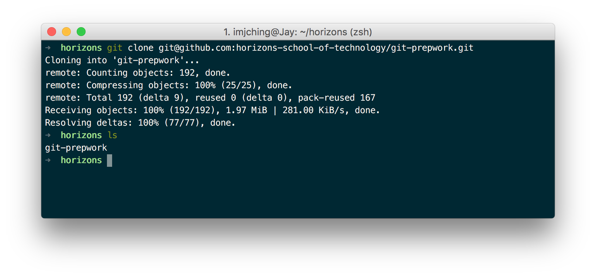
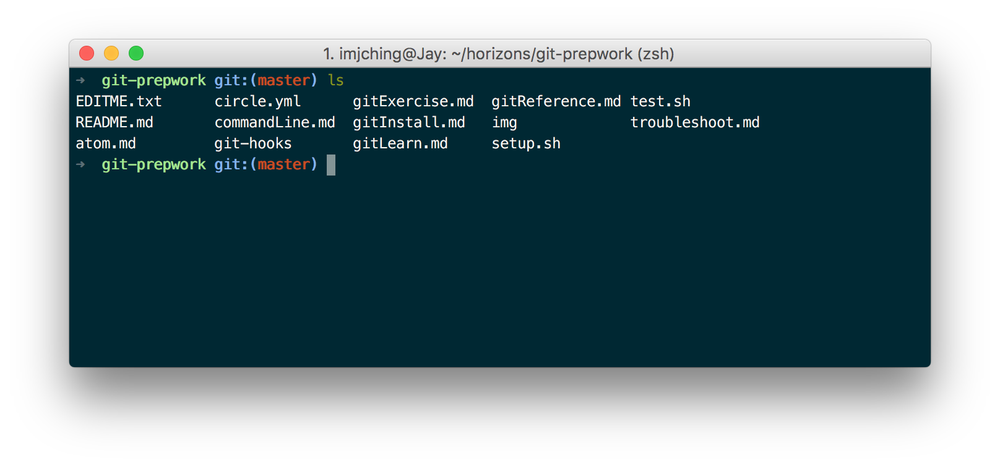
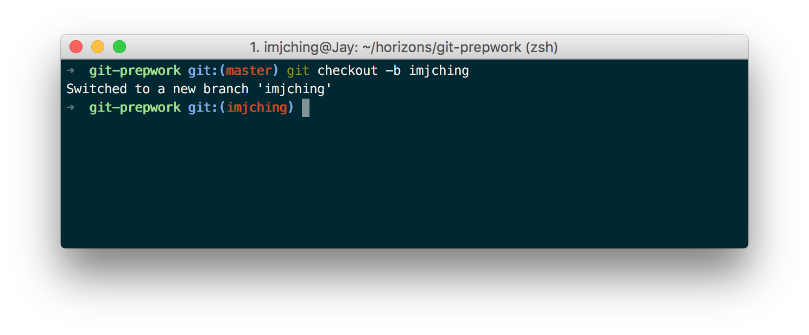
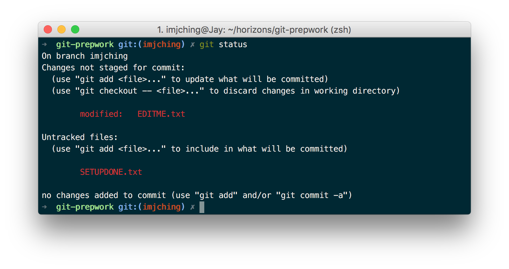
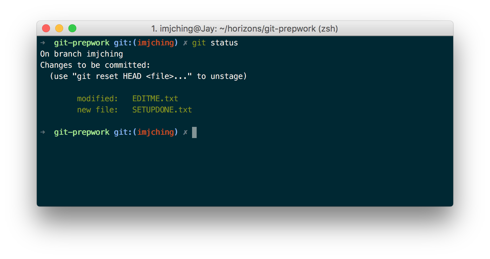
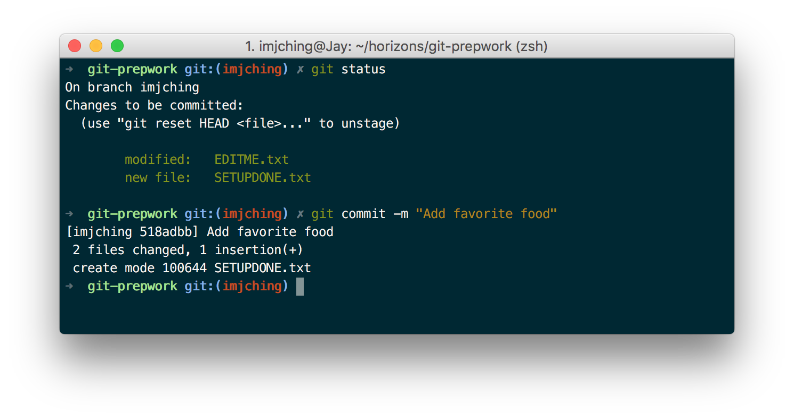
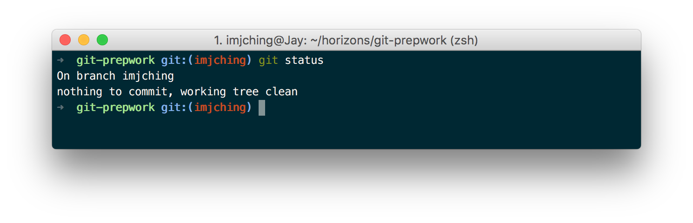
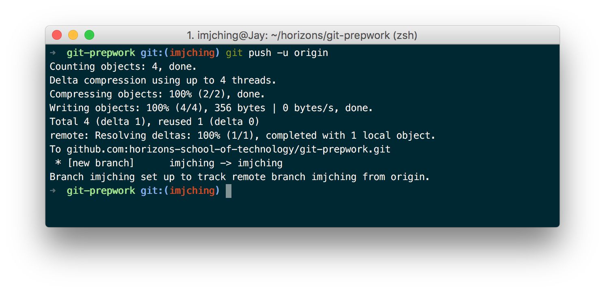
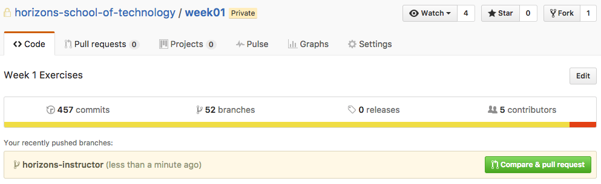
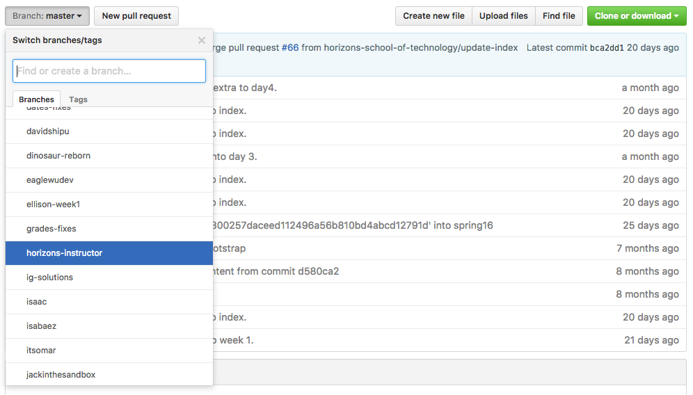

# Exercise 5: My first Git commit

1. Open your Terminal

    1. **(Mac)** Open the Terminal app located in `/Applications/Utilities/Terminal.app`
    1. **(Windows)** Open Git Bash from the Start Menu.

1. Create a new directory for Horizons course material and `cd` into it.

    ```bash
    mkdir horizons
    cd horizons
    ```

1. Run `pwd` to confirm you're in the right directory.

    ```bash
    pwd
    ```

    You should see that you're now in a directory named `horizons`:

    ```
    $ pwd
    YOUR HOME DIRECTORY HERE/horizons
    ```


1. Clone the `git-prepwork` repository.

    ```bash
    git clone git@github.com:horizons-school-of-technology/git-prepwork.git
    ```

    This downloads a copy of the `git-prepwork` repo into a directory with the
    name `git-prepwork`.

    

1. `cd` into your brand new copy of `git-prepwork`.

    ```bash
    cd git-prepwork
    ```

1. Run `ls` to see what files are in `git-prepwork`.

    ```bash
    ls
    ```

    You should see all the files Git downloaded from GitHub:

    

1. Cool! Let's create your own branch with your GitHub username.

    ```bash
    git checkout -b YOUR GITHUB USERNAME HERE
    ```

    A GitHub branch is like a private workspace within a repository. It lets
    you do work independently of everyone who is using the same repository.

    You can create a branch with any name but we use our GitHub usernames to
    avoid conflicting with other people who are creating branches.

    You should see: (Remember to use your GitHub username!)

    

1. Set-up your Git environment

    ```bash
    ./setup.sh
    ```

    You should see:

    ```
    $ ./setup.sh
    Update commit hooks in /Users/paksoy/Code/horizons/git-prepwork/.git
    Success! Your Git repository is ready to use
    ```

1. When setup finishes it will create a new file in your repository named
`SETUPDONE.txt`. Let's check the status of our Git repository and see if
this file is there.

    ```bash
    git status
    ```

    This will now display `SETUPDONE.txt` as a new file that's been created.

1. Open the `git-prepwork` folder in Finder (Mac) or File Explorer (Windows).

    **(Mac)**: `open .`

    **(Windows)**: `explorer .`

1. You should see a file named `EDITME.txt`. Open this file in Atom, your text editor.
1. Type in your favorite food under the question and save the file.

    ```
    What's your favorite food?
    Guacamole!
    ```

1. Now let's check the status of our Git repository again.

    ```bash
    git status
    ```

    This will now display `EDITME.txt` as a file that's been modified.

    

1. Let's get ready to commit (i.e. save) our changes to Git.

    The first step is to "stage" your changes with `git add --all`. This tells
    Git what files to include when you commit (i.e. save) your changes.

    ```bash
    git add --all
    ```

    Let's check the status of our repository again.

    ```bash
    git status
    ```

    You should now see that Git has marked `EDITME.txt` and `SETUPDONE.txt` as
    `Changes to be committed:`

    

1. Now let's commit (i.e. save) the files we have staged for committing with
`git commit`.

    ```bash
    git commit -m "Add favorite food"
    ```

    

    - ⚠️Tip⚠️ If you forget to include `-m` in `git commit -m`, Git will ask you to type
    in your commit message inside a text editor.
    [Use these instructions](troubleshoot.md#2-please-enter-the-commit-message-for-your-changes)
    to exit the text editor and try again.


1. Check that your repository is clean (i.e. all of your changes have been saved
to git). This is a good way to check whether or not all of your changes have
been committed.

    ```bash
    git status
    ```

    

1. Push (i.e. upload) your changes to GitHub. This will make your work public
and accessible via Github.


    ```bash
    git push -u origin
    ```

    You should see:

    

1. Now visit the
[git-prepwork repository on Github](https://github.com/horizons-school-of-technology/git-prepwork),
you will notice that there is a banner with your branch name. Our sample branch
is named `horizons-instructor`, your branch will have a different name.

    

1. If you click on the button titled `Branch: master` it shows all branches in
this repository. In this case you will see the branches created by fellow
students (including yours).

  

Congratulations! You're done setting up Atom and Git. Now you're ready to start your journey at Horizons!
