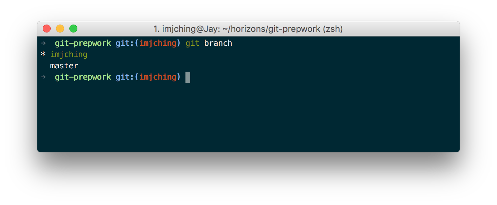

# Git Reference

## Glossary

- **Source code**: A file that contains code. Like `.js` files.
- **Git**: A tool for tracking and sharing changes in files. It also allows a team of people to work together on the same project files.
- **Repository**: A Git project
- **Branch**: A workspace within a project. This allows isolation of work. Think of branches as multiple folders having the same initial contents, and you add different features to each folder.
- **Commit**: Git tracks the history of a projects as a series of commits. A single commit is a group of changes to files in the repository.

## Retrieving changes to updated exercises

We will often make changes to exercises after you have cloned (downloaded) them.
To retrieve the latest changes made to any repository, follow these steps:

1. Make sure your branch is clean (all changes have been committed).
Run the `git status` command, and make sure it says
`nothing to commit, working directory clean`

    ```bash
    $ git status
    On branch your-branch-name-here
    Your branch is up-to-date with 'origin/your-branch-name-here'.
    nothing to commit, working directory clean
    ```

1. If your branch is not clean, then commit and push your changes.

    ```bash
    git add --all
    git commit -m "your commit message here"
    git push origin
    ```

1. Switch to the `master` branch.

    ```bash
    git checkout master
    ```

1. Retrieve the latest version of `master` from Github.

    ```bash
    git pull origin
    ```

1. Switch back to your own branch.

    ```bash
    git checkout your-branch-name-here
    ```

1. Merge the changes from `master` into your own branch.

    ```bash
    git merge master -m "Merge"
    ```

    > Sometimes, when you do `git merge master`, you will get an error which is commonly known as a merge conflict. Merge conflicts may occur if competing changes are made to the same line of a file or when a file is deleted that another person is attempting to edit. When you get this error, find an instructor for help. If merge conflicts are not resolved properly, your changes will be lost.

## Git Commands

We interact with Git using the command line. Here are some of the most
frequently used commands:

### `git clone url`

Download a remote Git Repository to your local machine (usually from GitHub)
from `url`.

### `git branch`

List all available branches for the repository. You will also see which branch are you at, and this is denoted by `*`.



### `git checkout -b branch-name`

Create a new branch called `branch-name` and switch to it.

A branch is a copy of your code that you can modify without affecting the
original. You will use branches to keep track of your own work keeping it
separate from your peers.

### `git checkout branch-name`

Switch to a branch named `branch-name`.

### `git status`

Display the current status of your repository. Includes information such
as:

- Current branch
- List of files changed
- List of files staged for commit

### `git add --all`

Mark (i.e. stage) files you have changed to be included in the next commit.

### `git commit -m commit-message`

Commit the staged files to the current repository with the message
`commit-message`.

### `git merge branch-name`

Merge changes from `branch-name` to the current branch

### `git push`

Upload your commits to a remote repository (usually GitHub).

### `git pull`

Download changes from a remote repository (usually GitHub) to your machine.

### `git stash`

Temporarily saves changes made to the project, and resets to the last commit.
Changes can be reapplied at any time using `git stash pop`.
