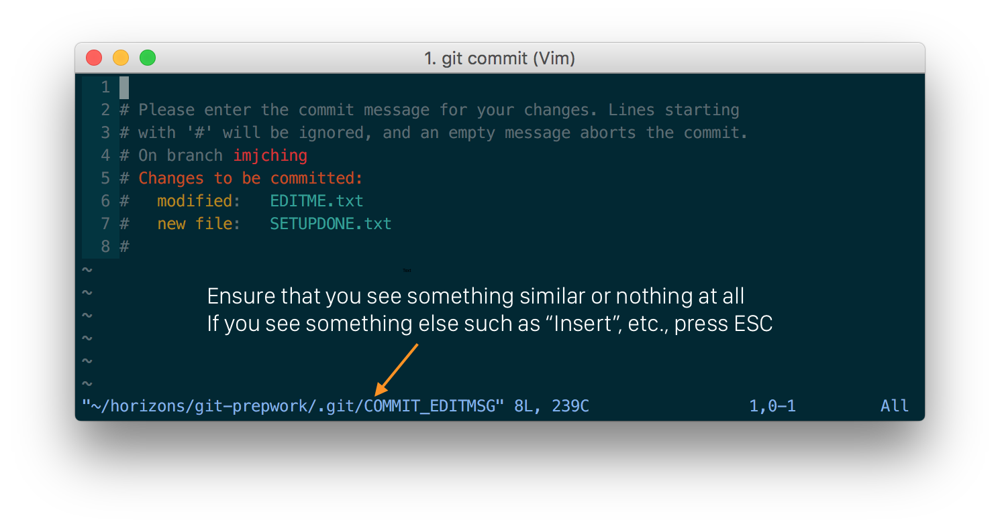
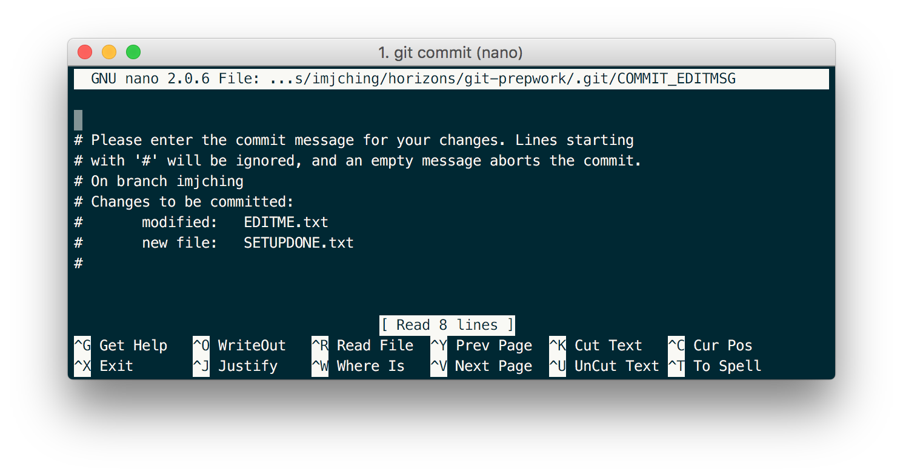

# Git Troubleshooting

Here are some common git errors you may run in to. If your error is not found in
this guide please feel free to ask an instructor for assistance.

### 1. `no changes added to commit`
This means that you forgot to include `-a` when running `git commit`.

  ```bash
  git add --all
  git commit -m "commit-message-here"
  ```

### 2. `Please enter the commit message for your changes.`

If this message shows up then you forgot to include `-m` when running
`git commit`. To fix this issue and go back to your terminal follow the steps
corresponding to your OS.

#### Mac

- If you see the following window

    

    Press <kbd>shift</kbd>+<kbd>z</kbd> **twice** to exit and try committing
    again with the `-m` in `git commit -m`.

- If you see the following window

    

    Press <kbd>shift</kbd>+<kbd>x</kbd> to exit and try committing
    again with the `-m` in `git commit -m`.

#### Windows

You should see an instance of Notepad open on your screen. Close this window and
type the correct command.

  ```bash
  git commit -am "commit-message-here"
  ```

### 3. `You cannot commit to 'master' in this repository.`

This message shows up when you are making changes to the master branch rather
than using your own branch. To fix this follow these commands:

1. Use the `git stash` command to put aside your changes temporarily. This will
hide your changes from git, and can be accessed at a later time.

    ```bash
    git stash
    ```

1. Switch to your own branch.

    ```bash
    git checkout your-branch-name-here
    ```

1. Bring back your hidden changes that were stashed in Step 1 to the current
branch.

    ```bash
    git stash pop
    ```

1. Commit your changes.

    ```bash
    git add --all
    git commit -m "commit-message-here"
    ```

### 4. `remote: error: GH006: Protected branch update failed for refs/heads/master.`

You may also see the following error message:
`! [remote rejected] master -> master (protected branch hook declined)`

This means that you have committed your changes to master instead of your own
branch. Please ask an instructor to help move your commits to the correct place.
