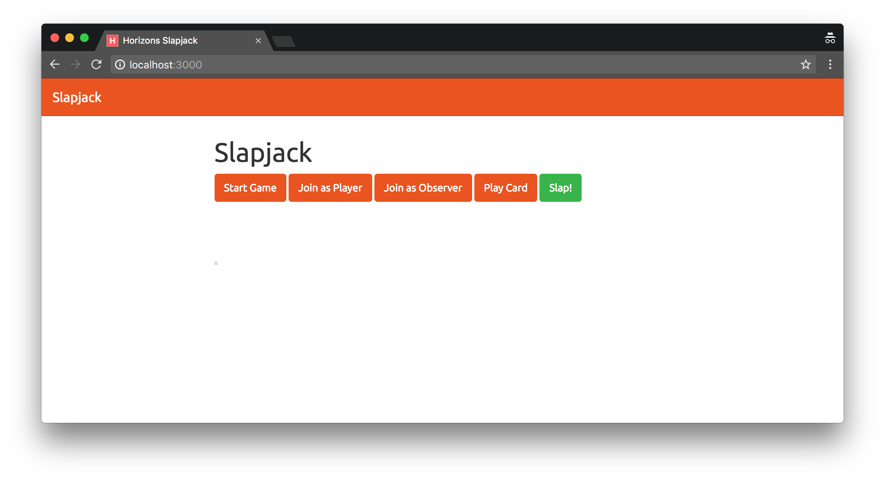

# Slapjack
Today, we'll be doing a fun project - implementing the multiplayer card game _Slapjack_ using WebSockets!

## Table of Contents

* **Rules of Slapjack** 🃏
* **Step 1:** Game Logic ♠️
* **Step 2:** Displaying Your Game ♥️
* **Step 3:** Persistence on Client and Server ♣️
* **Bonus:** Deploy, deploy, deploy! ♦️

## Rules of Slapjack 🃏

In Slapjack, the objective of the game is to win the entire deck of cards (52 cards).

At the beginning of a game of Slapjack, each player is dealt an equal number of cards facedown (players are not able to see their own cards or anyone else's cards).

> If the number of players does not divide 52, then a few players might get additional cards. For example, players in a 3-player game will have 17, 17, and 18 cards.

Players will then go in order, playing the top card in their deck to the top of the pile until somebody reaches 52 cards (_the winning condition of the game_).

At any time, players can gain cards by "slapping" the pile - in which case they either gain the pile or lose 3 cards based on the following conditions:

* If the top card of the pile is a Jack, the player gains the pile
* If the top two cards of the pile are of the same value (i.e., two Aces, two 10's, two 2's), the player gains the pile
* If the top card and third-to-top card are of the same value (sandwich - i.e. (Ace-10-Ace), (7-Queen-7)), the player gains the pile
* Otherwise, the player loses 3 cards on top of his or her pile to the **bottom** of the central pile

Players can slap the pile even when it is not their turn.

If multiple players slap the pile in close succession, all players except the first one lose 3 cards. The first player to slap will win or lose cards based on the conditions listed above.

## Step 1: Game Logic ♠️
We will isolate all of your Slapjack game's logic into a single module inside of `game.js`. We will also have `player.js` and `card.js` to help create necessary objects. Before you begin, make sure to run `npm install` to get all the dependencies you need to both start and test the application. In this step, you won't ever need to `npm start` - just run `npm test` when prompted to! In the next step, we'll be serving up the game to your connected users.

### ES6 Classes

The `Card`, `Player`, and `Game` objects are built using
[ES6 classes](https://developer.mozilla.org/en-US/docs/Web/JavaScript/Reference/Classes).
The syntax might be unfamiliar but they behave just like constructor functions we saw in Week 1.

In the following example `OldCounter` and `NewCounter` behave exactly the same. `OldCounter` is built using old-school JS syntax
and `NewCounter` uses ES6 syntax. Same thing different look.

```javascript
function OldCounter() {
  this.count = 0;
}

Counter.prototype.up = function() {
  this.count++;
  console.log(this.count);
}
```

```javascript
class NewCounter {
  constructor() {
    this.count = 0;
  }
  
  up() {
    this.count++;
    console.log(this.count);
  }
}
```

You can use this object with the `new` keyword.

```javascript
var c = new NewCounter();
c.up() // -> prints 1
c.up() // -> prints 2
```

### Cards 🂥 - `card.js`

We should only have two properties and three functions for any given `Card` object:

* The `value` of the playing card, from 1-13 (where Ace is 1, Jack is 11, Queen is 12, King is 13).
* The `suit` of the playing card, which any one of the following: _hearts_, _spades_, _clubs_, or _diamonds_.
* A `toString` function that allows us to get the human-readable description for the card, i.e. _Ace of Spades_, _8 of Hearts_, etc.
* Two more persistence functions: `fromObject` and `toObject`. (We have already done this for you and we will look more into this at Step 3.)

Complete the `Card` constructor which initializes those two properties and create the `toString` function which returns the human-readable description for the card as a string.

> Test: At this point, run `npm test` to check your progress and verify that the tests for `card.js` are working!

### Player 🐥 - `player.js`

Next, build out your `Player` object - your `Player` object should have three properties and three functions:

* `username`.
* `id` - generated upon construction.
* `pile` - represented by an Array of `Card` objects.
* A `generateId` function that helps to generate random strings.
* Two more persistence functions: `fromObject` and `toObject`. (We have already done this for you and we will look more into this at Step 3.)

Complete the `Player` constructor which initializes those three properties stated above. You can use `this.generateId()` for `id`. Also, the `pile` should be an empty array initially.

> Test: At this point, run `npm test` to check your progress and verify that the tests for `player.js` are working!

### Game 🏅 - `game.js`

We want to create some basic properties for our `Game` object as well. Below is a brief explanation of each property you need to create and how we'll be using them:

* `isStarted` - A Boolean to check if the game is in progress or not. Initially, this will be `false`.
* `players` - An Object to store the `Player` objects by the key of an ID and value of a `Player` object. We should be able to access `Player`s from this object with `players[id]`.
* `playerOrder` - An Array of IDs of players, representing their order in the game. The current player will always be at index 0.

	```
	Initially, this.playerOrder is [0, 1, 2, 3]
	// After player 0 has played, the array becomes
	// [1, 2, 3, 0]
	// After player 1 has played, the array becomes
	// [2, 3, 0, 1]
	// After player 2 has played, the array becomes
	// [3, 0, 1, 2]
	// After player 3 has played, the array becomes
	// [0, 1, 2, 3]
	// and the cycle goes on...
	```

* `pile` - An Array of `Card` objects representing the central pile.

The `Game` class will also have 11 functions - 6 game-related functions, and 5 persistence-related functions. We have completed the persistence-related functions for you.

> **Test:** Feel free to run `npm test` anytime to check your progress and verify that your methods are working!

You have to complete 6 game-related functions:

* `addPlayer(username)` - for adding players into the game
	* should take a `username` as a String
	* Throw an error if the game has already started
		* **Hint:** `this.isStarted`
	* Throw an error if the username is empty
		* **Hint:** `trim()`
	* Throw an error if the player's username is non-unique
		* **Hint:** check `this.players`
	* If no error was thrown:
		* **create** a new `Player` object with a username
		* **push** the new player's ID into `this.playerOrder` Array
		* **add** the new `Player` to the `players` Object.
			* **Hint:** `this.players[player.id] = player`
		* **return** the ID of the new `Player`

* `startGame()` - begin game setup
	* Throw an error if the game has already started
		* **Hint:** `this.isStarted`
	* Throw an error if the game has fewer than two people added
		* **Hint:** `this.players`
	* If no error was thrown:
		* **set** `this.isStarted` to `true`
		* **create** a standard deck of 52 playing cards (4 suits x 13 values) and shuffle them
			* **Hint:** You may find Underscore's `.shuffle` method helpful for implementing a Fisher-Yates shuffle!
		* **distribute** the cards evenly to all players
			* **Hint:** If the number of players does not divide 52, then some players might get more cards.

* `nextPlayer()` - move the current player to the next player. i.e. rotate `this.playerOrder` array by one to the left
	* Throw an error if the game has **not** started yet
		* **Hint:** `this.isStarted`
	* If no error was thrown:
		* **shift** the array by one to the left until the player at index 0 has a non-zero pile of cards.

			* **Hint:** All players have at least one card

				```
				Initially, this.playerOrder is [0, 1, 2, 3]
				// After player 0 has played, the array becomes
				// [1, 2, 3, 0]
				// After player 1 has played, the array becomes
				// [2, 3, 0, 1]
				// After player 2 has played, the array becomes
				// [3, 0, 1, 2]
				// After player 3 has played, the array becomes
				// [0, 1, 2, 3]
				// and the cycle goes on...
				```
			* **Hint:** Player 2 and 3 have no cards left

				```
				Initially, this.playerOrder is [0, 1, 2, 3]
				// After player 0 has played, the array becomes
				// [1, 2, 3, 0]
				// After player 1 has played, the array becomes
				// [0, 1, 2, 3]
				// (since 2 and 3 have no cards)
				// and the cycle goes on...
				```

* `isWinning(playerId)` - should take a Player ID and return a boolean to determine whether or not the Player corresponding to that ID has won
	* Throw an error if the game has **not** started yet
		* **Hint:** `this.isStarted`
	* If no error was thrown:
		* Check for a winning condition of a Player corresponding to the `playerId` passed in and, if a win occurred, set `this.isStarted` to `false` and return true.
		* Otherwise, return `false` - the Player did not meet a winning condition.

* `playCard(playerId)` - should take a Player ID of the Player attempting to play a Card
	* Throw an error if the game has **not** started yet
		* **Hint:** `this.isStarted`
	* Throw an error if the current Player ID does not match the passed-in Player ID (this means a player is attempting to play a card out of turn)
		* **Hint:** `this.playerOrder[0]`
	* Throw an error if the Player corresponding to the passed-in Player ID has a pile length of zero
		* **Hint:** `this.players[playerId].pile.length`
	* If no error was thrown:
		* **move** the *top* card of a Player's pile onto the *top* card of the Game pile.
			* **Hint:** The top card of the Player's pile refers to the last element in `this.players[playerId].pile`. Same goes to the Game pile.
		* **count** the number of players with 0 cards
			* If the number of players with 0 cards equals to the total number of players (i.e. everyone has no more cards), **set** `isStarted` to false and **throw** an error. (It's a tie!)
		* **call** `this.nextPlayer()` to move the current player		* **return** an object with two keys `card` and `cardString`.
			* **Hint:** (newCard refers to the card that was just placed on the top of the Game pile)

				```
				{
				  card: newCard,
				  cardString: newCard.toString()
				}
				```

* `slap(playerId)` - should take a Player ID of the Player attempting to slap and return an Object (format described below)
	* Throw an error if the game has **not** started yet
		* **Hint:** `this.isStarted`
	* If no error was thrown:
		* Check for any of the winning slap conditions
			* If the top card of the pile is a **Jack**
			* If the top two cards of the pile are of the same **value**
			* If the top card and third-to-top card are of the same value (sandwich)
				* **Hint:**

					```
					var last = this.pile.length - 1;
					this.pile.length > 2 && this.pile[last].value === this.pile[last - 2].value
					```
		* If there is a winning slap condition, **move** the pile into the **back of the pile** of the Player corresponding to the passed-in Player ID, and **set** `this.pile` to `[]`
			* **Hint:**

				```
				this.players[playerId].pile = [...this.pile, ...this.players[playerId].pile];
				```
			* Return an object with the following key-value pairs:
				* `winning: this.isWinning(playerId)`
				* `message: 'got the pile!'`
		* Otherwise, take the **top** 3 cards (at most) from the pile of the Player corresponding to the passed-in Player ID and add it to the **bottom** of the game pile
			* If the player has less than 3 cards, take everything. (Hint: `Math.min(3, len)`)
			* Return an object with the following key-value pairs:
				* `winning: false`
				* `message: 'lost 3 cards!'`

> **Test:** Feel free to run `npm test` anytime to check your progress and verify that your methods are working!

## Step 2: Displaying Your Game ♥️
Now that your game is setup and running, we are going to build out the front end of it so that your game doesn't just live in a variable on your Node server, but communicating with all connected clients and updating their views simultaneously.

### Sending WebSockets Events ☝️
First, a little crash course on using the [socket.io](http://socket.io) library we are using to send and receive events between our clients and server with WebSockets:

All messages sent between client and server on WebSockets happens in terms of "events" that are emitted and received. On both the client and server, `emit` sends an event back _to_ the other, and `.on` creates a handler to receive an event _from_ the other. For example:

<sub>Client</sub>

```javascript
socket.emit("cake", "Here is some strawberry cake"); // 1
socket.on("cake", function(data) {
  // Alerts with "The server said thank you for cake"
  alert("The server said " + data); // 4
})
```
<sub>Server</sub>

```javascript
socket.on("cake", function(data) {
  console.log(data); // Logs "Here is some strawberry cake" // 2
  socket.emit("cake", "thank you for cake"); // 3
});
```

Super simple, and fast! **Note that `socket.emit` only emits to one connected socket at a time** (where each client is represented by a single socket). In this case, `socket.emit('cake', ...)` broadcasts the `...` message to just one user (i.e. the user that invoked the `.on` handler).

To **broadcast an event** to all connected clients (excluding the current socket connection), call `socket.broadcast.emit` with the same parameters.

To **broadcast an event** to all connected clients (including the current socket connection), call `io.emit` with the same parameters.

> Technically, `io.emit` is the same as doing both `socket.emit` and `socket.broadcast.emit` at the same time. Want more? Visit this link: [https://stackoverflow.com/a/10099325](https://stackoverflow.com/a/10099325)

Our user interface looks like this. We have 5 buttons: Start Game, Join as Player, Join as Observer, Play Card, and Slap!



### Implementing those buttons 🔥 - `public/script.js`

We will work on those buttons individually. Below is a spec of the events that we want to emit back to the client and respond to from the client: use the scaffold to update game logic within these events and pass back to the client necessary game information.

> The ids in the parenthesis corresponds to the ids for the buttons. We have already created click handlers for you.

1. Join as Observer (`#observeGame`)
	* In the click handler, **disable** the `#joinGame` and `#observeGame` buttons.
		* **Hint:** look at the top of the file to see how the `#startGame` and `#playCard` buttons were disabled.
	* **set** the text for `#usernameDisplay` to `Observing game...`

1. Join as Player (`#joinGame`)
	* **prompt** the user for a username and **emit** a `username` event to the server with this prompt response.
		* **Hint:** You can use `.prompt` to get the input.
	* **`app.js`** - Since we are emitting a `username` event to the server, we need to handle this at the server as well. In the `username` handler (i.e. `socket.on('username', function(data) { ... }`), do the following:
		* *data* is a String (i.e. the username)
		* **try** to add the user to the game
			* **Hint:** Use `game.addPlayer(data)`. A try-catch block may come in handy!
		* If the attempt failed, i.e. `addPlayer` throws an error, emit back an `errorMessage` event with the error message as its contents
			* **Hint:** `socket.emit('errorMessage', e.message);`
		* If everything is good:
			* **set** `socket.playerId` to be the id of the player. (Think about what `addPlayer` returns!).
			* **emit** a `username` event to the same socket with an object with two properties: `id` and `username` of player.
			* **emit** an `updateGame` event with the value of `getGameState()` to **everyone including the socket itself**.
				* **Hint:** use `io.emit`
				* We will code `getGameState()` later.
	* **`script.js`** - Since we are emitting a `username` event from the server, we need to handle that on our client as well. (i.e. `socket.on('username', function(data) { ... })`).
		* **disable** the buttons with id `#joinGame` and `#observeGame`
		* **enable** the button with id `#startGame`
		* **set** the text for `#usernameDisplay` to `'Joined game as ' + data.username`
		* **set** `user = data`

1. Start Game (`#startGame`)
	* **emit** a `start` event to the server with no data
	* **`app.js`** - We will also need to handle the `start` event at the server. (i.e. `socket.on('start', function() { ... }`)
		* If `socket.playerId` is undefined, **emit** an `errorMessage` event with the message `You are not a player of the game!`
		* Otherwise, **try** to start the game using `game.startGame()`
		* If the attempt failed, i.e. `startGame` throws an error, emit back an `errorMessage` event with the error message as its contents
			* **Hint:** `socket.emit('errorMessage', e.message);`
		* If everything is good:
			* **emit** a `start` event with no data to **everyone including the socket itself**
				* **Hint:** use `io.emit`
			* **emit** an `updateGame` event with the value of `getGameState()` to **everyone including the socket itself**.
				* **Hint:** use `io.emit`
				* We will code `getGameState()` later.
	* **`script.js`** - Since we are emitting a `start` event from the server, we need to handle that in the client too!
		* **disable** the button with the id `#startGame`
		* **enable** the buttons with ids `#playCard` and `#slap`

1. Play Card (`#playCard`)
	* **emit** a `playCard` event to the server with no data
	* **`app.js`** - Let's handle the `playCard` event at the server.
		* If `socket.playerId` is undefined, **emit** an `errorMessage` event with the message `You are not a player of the game!`
		* Otherwise, **try** to get the current player to play a card. (`game.playCard(socket.playerId)`). Note that this function will return an object.
		* If the attempt failed, i.e. `playCard` throws an error, emit back an `errorMessage` event with the error message as its contents
			* **Hint:** `socket.emit('errorMessage', e.message);`
		* If everything is good:
			* **emit** a `playCard` event with that object that was returned from the `playCard` function to **everyone including the socket itself**. (**Hint:** use `io.emit`)
	* **`script.js`** - Let's handle the `playCard` event at the client.
		* Update your view to display a card - you will be only showing one card in the pile at a time.
		* **Note:** We have placed some nice, open-source SVG graphics of cards named like `10_of_spades.svg`, `ace_of_hearts.svg`, etc. Update the `src` of `#card`, an `` element! - perhaps with the data you receive from a `playCard` event? Think about how you will turn "King of Hearts" to simply `king_of_hearts.svg`!

1. Slap! (`#slap`)
	*  **emit** a `slap` event to the server with no data
	* **`app.js`** - Let's handle the `slap` event at the server.
		* If `socket.playerId` is undefined, **emit** an `errorMessage` event with the message `You are not a player of the game!`
		* Otherwise, **try** to get the current player to slap the pile. (`game.slap(socket.playerId)`). Note that this function will return an object. i.e.

			```
			{
			  winning: this.isWinning(playerId),
			  message: 'got the pile!'
			}

			OR

			{
			  winning: false,
			  message: 'lost 3 cards!'
			}
			```

		* If the attempt failed, i.e. `slap` throws an error, emit back an `errorMessage` event with the error message as its contents
			* **Hint:** `socket.emit('errorMessage', e.message);`
		* If everything is good:
			* **check** if the `winning` property in the object returned is true. If it is, **set** `winner` to be the username of the player who just slapped the pile.
			* There are two conditions to check now:
				* If the message returned is `got the pile!`, do `io.emit('clearDeck')`.
				* If the current player has no more cards after slapping:
					* Check if there is only one player left. If it is, set `winner` to be that player's username, and `game.isStarted` to be `false`.
					* Otherwise, call `game.nextPlayer()`.
			* Next, broadcast an `updateGame` event with the value of `getGameState()` to everyone including the current socket.
			* Finally, emit two `message` events: one for the current player, and one for everyone else. For example, the current player receives `You lost 3 cards!` and everyone else receives `[Username] lost 3 cards!` (Use `socket.emit` for self and `socket.broadcast.emit` for everyone else)
	* **`script.js`** - Note that we emitted two extra events: `clearDeck` and `message`.
		* For `clearDeck`, remove the src attribute on the `#card` element.
		* For `message`, append the data into the `#messages-container` element. You can set a timeout to fade the message out after 5 seconds.

#### Updating Other Game State Properties

We need to complete the `getGameState()` function inside `app.js`. This should return an object with the following fields:

- `isStarted`: A boolean value indicating if the game has already started
- `numCards`: an Object with the keys as playerIds and the value as the number of Cards
- `currentPlayerUsername`: the username of the current player's name. If the game has not started yet, return `Game has not started yet` as the `currentPlayerUsername`
- `playersInGame`: A string with the name of all the players in the game (e.g. `Ricky, Moose, Abhi, Darwish`)
- `cardsInDeck`: How many cards are in the current pile
- `win`: the name of the winner if it exists, otherwise, undefined (see `winner`)

## Step 3: Persistence on Client and Server ♣️

### Implementing Sessions (Client)

#### Persisting the ID for the Client - `public/script.js`
You may have noticed during testing that every time you refreshed your browser while the server was running, it would prompt you for another username if you click on `Join as Player`, not allowing you to jump back into the game as the same user you played with before. We will implement a simple form of sessions using unique IDs.

We will store unique IDs in `LocalStorage`. [`LocalStorage`](https://developer.mozilla.org/en-US/docs/Web/API/Window/localStorage) is a mechanism for storing key-value pairs in the browser on a per-website basis. When we get back a unique User ID from the server with the `username` event, we will store it in `LocalStorage` rather than in a variable. To set something with a browser's `LocalStorage` looks like the following:

```javascript
localStorage.setItem("cake", "strawberry"); // first parameter is key, second parameter is value
```

Getting an item back from `LocalStorage` is very similar; just change the name of the method to `getItem` and pass in a key:

```javascript
var cake = localStorage.getItem("cake"); // variable cake is now "strawberry"
```

Note that if `getItem` is called with a key that is not defined or found in `LocalStorage`, it will return null. Thus, rather than initially setting our ID variable of the user playing to an empty string, we want something along the lines of:

```javascript
var id = localStorage.getItem("id") || "";
```

Here, if `LocalStorage` does not have our item, `id` will be set to empty string.

Modify your `#joinGame` click handler so that it check if `localStorage.getItem('id')` is null - this means that the user has not played yet and we need to prompt for a username and emit the input entered. Additionally, when we initially get an ID back from the `username` event now, **we want to make sure that we are saving it** to `LocalStorage` with `setItem`.

In the case where `localStorage.getItem("id")` is non-null, on the other hand, we need to send an event back to the server presenting an ID of a currently playing user. To make the distinction between a new player and an existing player attempting to re-join, we will emit a `username` event with an Object formatted like the following to the server in our click handler:

`{ id: "XXXXXXXXX" }`

We'll deal with re-associating the new `socket` connection with the existing player in the next section.

#### Re-setting the ID on the Server - `app.js`

Modify the `username` event handler on the server to check if we are receiving a String (in which case, a new user is attempting to join the game) or if we are receiving an Object with an ID (in which case, an existing user is re-joining the game).

Your new `username` event handler should do the following:

1. If the data received is a String, do the same thing as before.
2. Otherwise, if the `data` we receive is an Object, check if `data.id` is actually a player id (key) in `game.players`.
	* If it is not, do `socket.emit('username', false)`.
	* If it is, set `socket.playerId` to `data.id`. Now, additional calls to `slap` or `playCard` will be using the correct Player ID. Finally, do the following to initialize the game state of the player who is re-joining.

		```
		socket.emit('username', {
		  id: data.id,
		  username: game.players[data.id].username
		});
		io.emit('updateGame', getGameState()); // broadcast to everyone
		```
3. Since we are emitting back a `username` event with `false` as a value if the ID is not registered on the server, we need to handle that accordingly in `script.js`.

	```
	if (data === false) {
	  localStorage.setItem('id', ''); // reset the id in localStorage


	  // prompt the user for a username and
	  // emit this value under the `username` event to the server

	  return;
	}
	```

### Bonus: Implementing Persistence on Server

Go to the bottom of your `game.js` file and take a look at the persistence functions we have built in for you. Determine where you need to call `this.persist()` in your game to save the game state!

If you do so, remember to implement the restart feature so that the game can be restarted through the client.

## Bonus: Deploy, deploy, deploy! 📦

Deploy the entire application on Heroku and play with your friends.

> A double bonus would be to implement custom rooms for each game.
