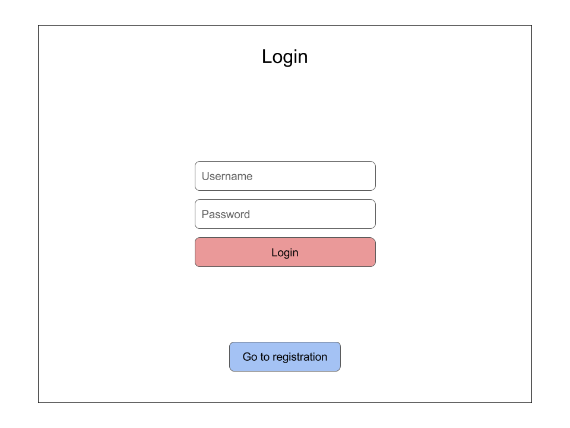
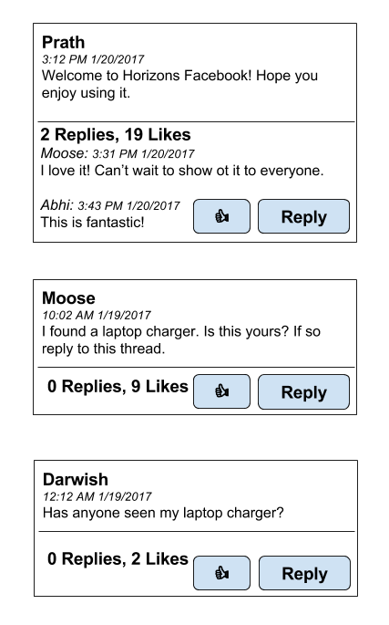

# Facebook Exercise


**You either change the world or you don't.** *Logo Design Inspired by Zinger.*

At this point, you've learned about JavaScript essentials, HTML and CSS with Bootstrap, DOM manipulation with jQuery, and API usage with AJAX. It's time to put all these skills into action. Ready?

**Instructions:**

1. Build Facebook

...okay, we'll give you a _little_ more than that.

## Introduction

Building Facebook is your first test of design patterns and skills in DOM manipulation and AJAX requests in a less guided scenario.

_Focus on implementing the core functionality first, and worry about styling and CSS later._ Making it work is more important than making it look good. If you are spending most of your time writing your CSS, you are not using it in the best way. Form follows function!

_Use the design patterns you know, but make sure you understand what you are building._ You will find that many of the skills you learned in building Horello will apply here: creating data models and rendering HTML bits in jQuery for each component are good ideas to tackle this exercise. At the same time, this doesn't mean you necessarily need all the complexity of Horello within your initial attempts at building Facebook. If it makes more sense to you to view the problem with a different approach, use it.

_Stay organized._ Outlining the flow of your Facebook implementation or taking each component below one-by-one is a good idea. Well-structured code is easier to debug, easier to write, and easier for other people to understand.

That's all. Move fast and break things! *

<sub>_* not the server though, thanks_</sub>

## Required Components

The components we want you to build are below. We recommend you approach each one as a step building off the other, but you may take the components in any order you'd like. Keep in mind that many of these components rely on your implementation of registering and authenticating a user.

1. **Registration**: You will need to allow a user to fill out a form to register with email, password, first and last name.

2. **Login**: You will need to present existing users with a login that authenticates with email and password. Upon successful login, our server will return you a token to pass into subsequent requests.

3. **Posts**: For authenticated users, you will need to present a Newsfeed with Post objects returned by our server and a component to allow users to submit posts to the Newsfeed. Posts are plain-text and only have information on the poster's name and time submitted.

4. **Likes**: Each post will need to have a Like button to allow authenticated users to Like posts on the Newsfeed. Likes are stored as an array on each Post object and have information on the user who Liked the post.

5. **Comments**: Each post will also need to allow users to Comment on Post objects - comments will also be stored as an array on each Post object and contain the comment contents and information on the commenter.

6. **Bonus: Relative Date**: Using `https://momentjs.com/` figure out a way to add relative time to all of your posts. So instead of an absolute date a post would have a date relative to the current date (i.e. posted 5 minutes ago).

7. **Double Bonus: Chat**: See *Using Sockets* for more information on how to implement Chat. You will be adding a chat section to your Facebook site to have a central chat feature for all users on your site.

Yes, it's a lot - but if Mark Zuckerberg can do it, you can too!

## API Reference

The link below shows the live server specifications for accessing our "Facebook" API. All routes marked by a lock symbol (🔒) require you to pass in the token that you receive upon successful login. This token changes across users and sessions! Store it for authenticating each request as necessary.

⚠️ All requests with a 🔒 next to the title require authentication.

### Documentation

Reference: [https://horizons-facebook.herokuapp.com](https://horizons-facebook.herokuapp.com)


## Instructions
These instructions are very minimal in nature and should only be used as a guide to creating your Facebook newsfeed **(they should not be followed religiously as the final app should be your own creation)**. Additionally, the *pictures* throughout this guide are merely visual aids to help you understand and visualize each step, so **do not** imitate the designs used for the images.

You are provided with the following files to start making your Facebook Newsfeed:

  * `/facebook/index.html`: This will be the main page of your app where you will write all of the necessary `HTML`.
  * `/facebook/css/style.css`: This will be our primary style sheet for the app. You can add more stylesheets if you would like.
  * `/facebook/js/script.js`: We will write all of our `Javascript & jQuery` in here.

**Note** that the Bootstrap libraries are commented out in the `index.html` file. If you would like to use Bootstrap you should uncomment the lines after **UNCOMMENT IF NEEDED**.

### Register

1. Add `HTML` to your `index.html` file to build a registration form for new users. A new user **must** have a first name (*fname*), last name (*lname*), email address (*email*), and a password (*password*).

  

1. Much like login you should create a form like the one above with the four *required* properties in `<input>` fields, and when the `Register` button is pressed the `AJAX POST request` to `https://horizons-facebook.herokuapp.com/api/1.0/users/register` should occur (with fname, lname, email, and password).

1. On success the `AJAX` response should contain `{success: true}` (and that's it).

1. Now the Login section should reveal itself while the Register section should hide the form.

### Login

1. Write the front-end code the login section of your Facebook site. One way to create the login form is to create `<input>` elements and a `<button>` element with a click handler. When the button is pressed you should use the values in the input elements to populate your `AJAX` request.

  

1. Using `AJAX` take the two input elements and `POST` them to the `/users/login` endpoint.
`url: https://horizons-facebook.herokuapp.com/api/1.0/users/login`. Refer to the **API Reference** to see what the request/response should look like.

  ```javascript

  $.ajax('url-goes-here', {
    method: 'POST',
    success: function(data) {
      // data will be the response data that is
      // returned by the endpoint. use this to
      // access the token for future authorization.

      // data.response.token will give you access
      // to the AUTH_TOKEN
    },
    data: {
      email: String,
      password: String
    }
  });
  ```

1. If all goes well you will get back a `JSON` response that looks something like: `{success: true, response: {id: USER_ID, token: AUTH_TOKEN}}`. You should store the `AUTH_TOKEN` in [localStorage](https://developer.mozilla.org/en-US/docs/Web/API/Storage/LocalStorage) using `localStorage.setItem('token', data.response.token)`. The token can be accessed at a later time using `localStorage.getItem('token')`.

1. You can now hide this (login/registration) section of the `HTML` and reveal the newsfeed.

### List Posts

1. Once you have tackled the login/register pages, the next step is to retrieve and list posts currently on the database.

  

1. Using `HTML` and `CSS` create what you want your newsfeed posts/comments/likes to look like. You should do this before you use `AJAX` requests to populate these elements.

1. Refer to the **API Reference** to figure out what a `GET /posts` request/response should look like. You only need to include your `token` in the request header.

1. The response to your `AJAX` request will be in `JSON`, and your job is to parse the object and convert all of the posts into `HTML`. Recall the `jQuery` syntax used to `.append()` cards to your list; similarly, parse the response object into useful post information (i.e. post creation date, poster, post content...).

1. Be sure to add a like and comment/reply button as we will be implementing that functionality later on.

### Post Posts

  

1. In order to publish posts onto the database you should first create an input box with a submit/post button.

1. When the click event is triggered you should call the `POST /posts` endpoint to post your literary masterpiece from the input box. Use the **API Reference** to figure out what your request/response should look like.

### Likes/Comments

1. At this stage in the guide you have most likely mastered `AJAX Requests/Front-End Programming`. So refer to the **API Reference** guide to figure out how to like/comment on existing posts.

1. Make sure you have a `Like` button and a `Comment` button.

1. Remember that `POSTing` to the `/posts/comments/:id` endpoint requires a message, so you need to also add UI functionality to get user input for a comment.

1. Another thing to note is that the `/posts/likes/:id` endpoint just toggles the current state of the like button.

### Update Page

1. We have also learned about `Asynchronous` behaviour, and have been introduced to functions such as `setInterval` and `setTimeout`.

1. Since the `/posts API` endpoint has all of the required information for the newsfeed (i.e. posts & comments & likes) we should periodically update our newsfeed by sending out `AJAX requests` to this endpoint.

1. In order to minimize traffic at that endpoint requests should be submitted at least 30 seconds apart.

### Logout

1. When ending the session be sure to *logout*. The `/users/logout` takes in your AUTH_TOKEN as parameters and (if successful) responds with `{"success": true}`.

## Double Bonus: Chat

### Using Sockets

Read this when you are working on your Chat component! Implementing Chat will require you to use a protocol you have not used before: WebSockets. WebSockets is a realtime, event-driven protocol that allows us to create applications like chat that are extremely responsive. We will interface with WebSockets using a client library called [Socket.IO](http://socket.io) - import their library to your page with the following line:

`<script src="https://horizons-facebook.herokuapp.com/socket.io/socket.io.js"></script>`

**NOTE:** Learning to use the socket.io library will be an exercise in reading documentation and determining how to use it successfully.

We can connect to our socket.io server by doing the following:

```
var socket = io.connect('https://horizons-facebook.herokuapp.com/');
```

Upon connecting successfully to the socket.io server, please emit a new `authentication` event in the following format: `{ token: AUTH_TOKEN }`.

```javascript
socket.emit('authentication', {'token': localStorage.getItem('token') });
```
You have 5 seconds after connecting to the socket.io server to present your authorization token you received upon login, or you will be disconnected from the server. If you successfully authenticate, you will receive the `authenticated` event through the `on()` method and will be ready to begin sending messages.

All new messages are sent by emitting the `message` (send the message you are sending in plain text, without an object); if you are authorized, our socket.io server will broadcast the new message in the following form: `{username: *username*, message: *the message*}`.
