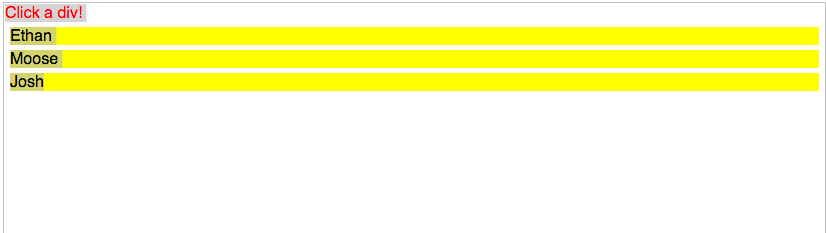
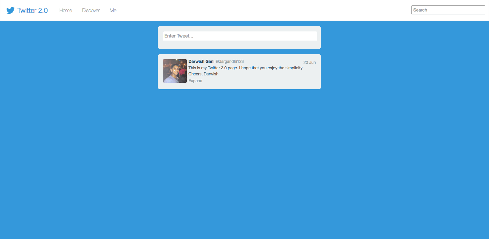

## Day 6 - Frontend Practice! 

For the following problems, you use the `scaffold` directories to get empty HTML pages with JQuery, Bootstrap, and Underscore already required for you. You will write your JS in `main.js` and your css in `main.css` :). 

Enjoy. 

### Problem #1: JQuery Practice

Create an empty HTML page with an unordered list (`</ul>`) with 10 list items (`<li>`) that store names of 10 of your horizonite classmates. Print the index of the of the list item when a list item is clicked. Above is an example with 3 names.The scaffold file for this problem starts you off with the right HTML! 

NOTE: Don't add `id's` or `classes` to any of the HTML elements! That would make this too easy.

NOTE 2: YOU CANNOT USE THE `index` or `indexOf` functions in jQuery to do this. 

### Problem #2: Simple Twitter

Build a simplified single-page version of something like the Twitter Home page, which should:
- Have an input box + submit button at the top that allows a user to enter new status messages
- Upon submission, insert the latest message at the top of an area below the input box (the user should be able to enter as many messages as they want)
- Restrict the user input to 140 characters
- Show the user's avatar, message, timestamp, and a few action links (like Favorite and Reply) on each message - the timestamp and links don't have to do anything or be dynamic, they can just be styled text, and the avatar is obviously just static
- Be a single page with no back end refreshing the page obviously clears everything out
- Be styled as if you were going to deploy this to Twitter or Facebook pretend you're building this as if it would be shown on a live site immediately to millions of users. The interaction and design are an important parts of the exercise, since we're looking for product engineers that can build production-ready features
- The exercise is fairly open-ended as we want to get an idea of your ability to create something great
without always having detailed design input. Feel free to use any tools you want (jQuery, SASS, etc.), and it doesn't need to support IE or anything. The deliverable should be a zip file with the page and any assets.

The devil is also in the details:

### Problem #3: Infinite Scroll

Create an infinite scroll page as seen in the GIF above. You will create a list of tiles that hold a random person's name. Names must be generated through `https://randomuser.me` by making a request to `https://randomuser.me/api/`. This API returns JSON data about a single random user. You can parse this data to find the user's first name. You will then display it in a tile as seen above. 

Your page must behave as follows: 
	
1. Load 50 new users upon page load. Note: The randomuser API only supports requesting 1 user at a time. 
2. When a user scrolls to the bottom of the page, load 50 more new users. 
3. You should render each new user's tile as his/her data is received from the server. You should also update the count at the top of the page as each new user's data count.
4. Every time you start 50 new requests, show a "started" notification under the count. Once all 50 students are back, make the notification say "finished". After 2 seconds, the "finished" notification should disappear. 

### Problem #4: Calendar Challenge

Given a set of events, render the events on a single day calendar (similar to Outlook, Calendar.app, and Google Calendar). There are several properties of the layout:

1. No events may visually overlap.
2. If two events collide in time, they must have the same width.
3. An event should utilize the maximum width available, but constraint 2) takes precedence over this constraint.

Each event is represented by a JS object with a start and end attribute. The value of these attributes is the number of minutes since 9am. So {start:30, end:90) represents an event from 9:30am to 10:30am. The events should be rendered in a container that is 620px wide (600px + 10px padding on the left/right) and 720px (the day will end at 9pm). 

The styling of the events should match the attached screenshot. You may structure your code however you like, but you must implement the following function in the global namespace (can be called from the developer console). The function takes in an array of events and will lay out the events according to the above description.

`function layOutDay(events) {}`

This function will be invoked from the console for testing purposes. If it cannot be invoked, the submission will be rejected.

In your submission, please implement the calendar with the following input:

`[ {start: 30, end: 150}, {start: 540, end: 600}, {start: 560, end: 620}, {start: 610, end: 670} ];`

A screenshot of the expected output is attached.

FAQ

1. Are frameworks such as JQuery, MooTools, etc. allowed? Yes, but please include the file with your source code.

2. Is there a maximum bound on the number of events? You can assume a maximum of 100 events for rendering reasons, but your solution should be generalized.

3. Does my solution need to match the image pixel for pixel? No, we will not be testing for pixel matching.

4. Is it safe to assume that I am supposed to re-render the entire calendar day if the layOutDay method is called in the Console? Yes, you should throw everything away and re-render from scratch every time the function is called.
