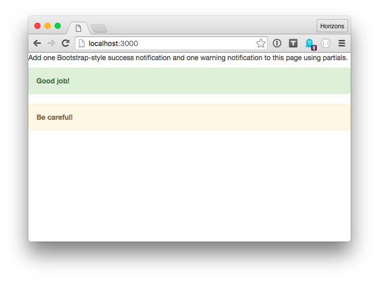
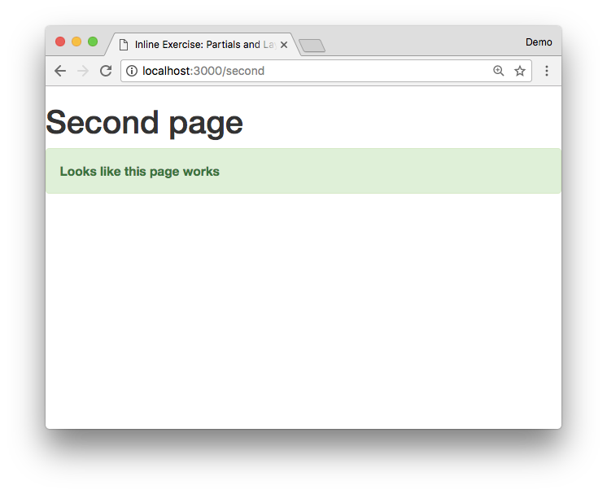

# Inline exercise: Handlebars Layouts and Partials

## Goal

Re-use Bootstrap components more easily using partials and get rid of
boilerplate using layouts.

## Instructions

1. Open `week03/day3/partials` in your Terminal
1. Install dependencies with `npm install`
1. There's a partial for success notifications in `views/partials/success.hbs`.

    Add a success notification to `views/index.hbs` using the `{{> partial arg="val"}}` syntax.

1. Create a partial `views/partials/warning.hbs` that generates a Bootstrap warning notification.

    See [info on Bootstrap notifications](http://www.w3schools.com/bootstrap/bootstrap_alerts.asp) for how to render warnings with bootstrap.

1. Add a warning notification to `index.hbs` using `warning.hbs`.
1. Start your app with `npm start` and verify that [http://localhost:3000/](http://localhost:3000/) looks like:

    

1. There's a second page provided at [localhost:3000/second](http://localhost:3000/second)
check it out:

    

1. The source for this page is located at `views/second.hbs` open it
in your text editor. Note how `second.hbs` shares a lot of code with `index.hbs`
1. Create a main layout in `views/layouts/main.hbs` and move the boilerplate
code out of `index.hbs` and `second.hbs` here.

    When you're done `second.hbs` should only contain

    ```handlebars
    <h1>Second page</h1>

    {{> success msg="Looks like this page works"}}
    ```

1. Update your `app.js` and enable layouts by editing this chunk of code

    ```javascript
    app.engine('hbs', exphbs({
      extname:'hbs',
      // Add main layout here
      // YOUR CODE HERE
    }));
    ```

    <details><summary>
    Hint
    </summary><p>

      Replace `YOUR CODE HERE` with the following

      ```javascript
      defaultLayout: 'main.hbs'
      ```

    </p></details>
1. Restart your app and verify that [localhost:3000](http://localhost:3000/) and [localhost:3000/second](http://localhost:3000/second) look the same as they did
before.

Congrats! You're done with this inline exercise!
